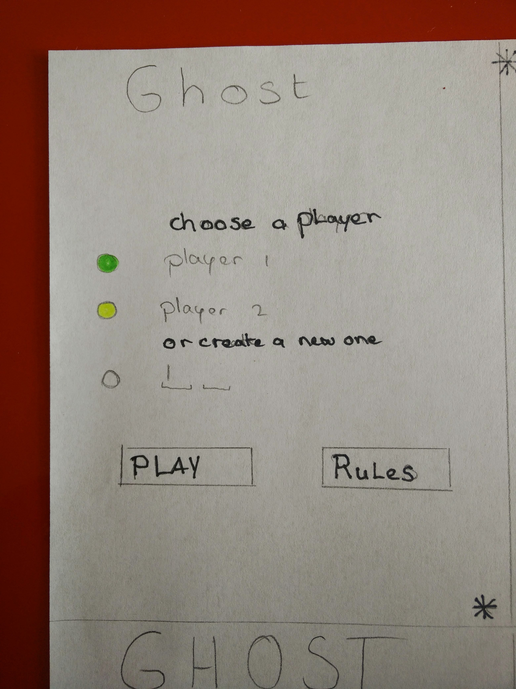
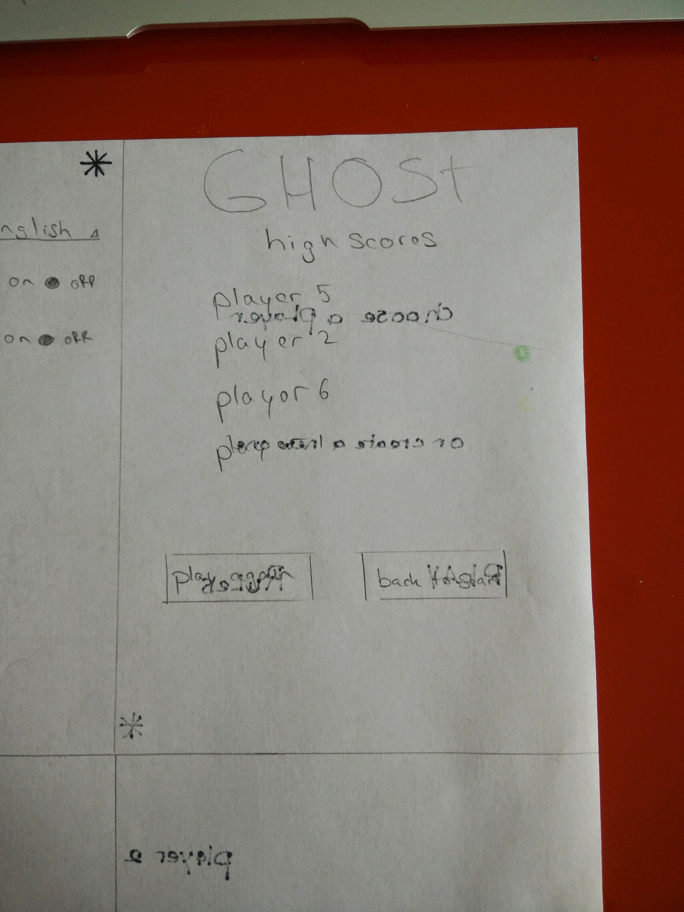

Ghost for Android Design Document
=================================

#Classes#

-Start.java

	- public class Start extends ActionBarActivity
		- public void toggleHideyBar()
		- public boolean onOptionsItemSelected()
	- public void onStartClicked( View view)
		- Intent playerInfo (PlayerName, PlayerColor)
	- public void onRulesClicked( View view)
	- public void onSettingsClicked(View view)

-Game.java

	- public void checkLetter( letter )
		- returns true/false
	- public void changePlayer( View view, PlayerId)
		- returns PlayerName, PlayerColor, PlayerId
	- public void playerWon( View view, PlayerId)
		- Intent playerInfo (PlayerId)

-Highscore.java

	- public void getPlayers( PlayerName, PlayerScore)
		- returns AllPlayers
	- public void addWin( PlayerId )
		- returns NewHighscore
	- public void onPlayAgainClicked( View view)
		- Intent playerInfo (PlayerId, PlayerName, PlayerColor)
	- public void onBackToMenuClicked( View view)

-Settings.java

	
	- protected void onCreate(Bundle savedInstanceState)

-Player.java

	- private String name
	- private Int id
	- private Int score
	- private Int color

	- public player()
	
	- public String getName()
		- returns PlayerName
	- public int getScore()
		- returns PlayerScore
	- public int getColor()
		- returns PlayerColor
	- public int getId()
		- returns playerId

	- public void setId( int id)	
	- public void setName( String name)	
	- public void setScore( int score)		
	- public void setColor( int color)

#Layouts#

- start_activity
- game_activity
- highscore_activity
- won_activity
- settings_activity
- rules_activity
- colorpicker_activity
- preferences
- strings
- array

#Start#

Basic elements on screen
- Welcome message to the Players 
- Players which already have played
	- PlayerName, PlayerColor, PlayerScore
- Option to make a new player
	- PlayerName, PlayerColor, PlayerScore(0)
- Settings
- Dailog for the rules

Specific controls
- Immersive mode
- TextEdit
- TextView
- Button
- Dailog

#Game#

Basic elements on screen
- Letters
	- First letter at random??
	- Display already typed letters
	- Display only next TextEdit 
- Player names
	- Colored background
	- playerName bold
- Settings
- Dailog
	- displaying winner
	- play again
	- see highscores

Specific controls
- Immersive mode
- TextEdit
- TextView
- Button
- Dialog

#Settings#

Basic elements on screen
- Choose language of the dictionary
	- English, Dutch
- Show rules dialog

Specific controls
- TextView
- Spinner
- Button
- Dialog

#Highscore#

Basic elements on screen
- Show all players scores
- Give option to play the game again with the same players 
- Give option to go back to the start menu

Specific controls
- TextView
- Button

#Frameworks:#
The application will be written in native Android application written in Java. Lots of build-in classes will be used and XML for the activities.

Depening of possibilty of testing on an Android 5.+ device, i'll be using the material design guidelines, patterns and colors. Otherewise I'll be using the design guidelnies, patterns and colors of Android 4.4. Kit Kat.

Colorpicker:
Depending on the diffuclty and time i would like to implement a colorpicker so that the background can change in the color of the player chosing when it's their turn to play.

Gestures:
Most gestures will be single touch gestures, tapping the settings icon will open the menu or swiping it to the top off the screen will open it.

Navigition:
Use of the back button on the screen will bring you back to the start screen. 

Full screen:
The game will be played in full screen, so players are not distracted by any notifications in the top system bar. The systems bars can be brought back by swiping from any side edge of the screen. Immersive mode

Acknowledging:
There will be an acknowledging screen when a player has won the game, this wont a toast screen but a bigger screen which will be displayed for 10 seconds so people can read the reason for winning and the defenition of the possible real word. Dialog

Settings:
For certains features, there is the need to give the players an option for settings. 

