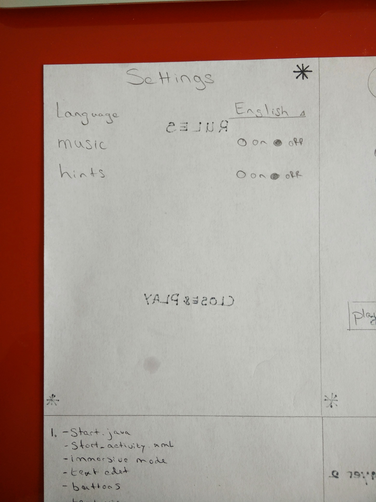

Project title: Ghost for Android
================================

#project description#
Ghost is a letter game, two players add a letter to the non excisting word. The player who makes it a real word loses.

#Features:#

-Before the game actually starts, it must ask the users for their respective names. If the game has been played before, all previously used names should be provided by the app to choose from.

-The game must be interactive: at each step, it should say who the current player is and what the current word fragment is.

-The player must be able to input a letter guess via an on-screen keyboard.

-Your app must only accept as valid input single alphabetical characters (case-insensitively). Invalid input (e.g., multiple characters, no characters, characters already inputted, punctuation, etc.) should be ignored (silently or with some sort of alert) but not penalized.

-The letter should be added to the word fragment and the updated word fragment should be displayed.

-The game should end if the current player has formed a word (longer than 3 characters) or no words can be formed.

-The game must have a choice of dictionaries: either Dutch or English.

-During game play, the user should be allowed to hit a menu button to cause some form of menu to appear and allow the user to restart the current round or change the language.

-If the user changes the language of the game it must cause game play to restart. The preference should survive if the user quits and re-opens the app. If no preference is set, the default language should be used.

-The game’s state must survive if the user quits the app or other activities appear above it. The end result should be that users can return to the game and continue playing where they left off even if the app is quit or the device is turned off.

-When a player has won, a new screen must appear that congratulates the winner on their accomplishment and state the reason for winning.

-Then, the player should be shown their place in the high score list, where each game that is won counts towards the score.

-Finally, there must also be a way to immediately start a new game or change the player’s names. 

#Sketches#
The sketches can be found in the doc folder

#used frameworks#

Java, Android, XML

import android.support.v7.app.ActionBarActivity;
import android.os.Bundle;
import android.view.Menu;
import android.view.MenuItem;
import android.view.View;
import android.widget.CheckBox;
import android.widget.ImageView;
import android.database.sqllite;
import android.text
import android.text.format
import android.text.method

