Technical Review
================

Project : Ghost for Android
--------------------------
#####Instructor: Martijn Stegeman 

#####Student: Bastiaan Waanders

#####Student number: 10247742

###Table of contents:

1. Different screens
2. Model Classes, private fields public methods
3. API's and frameworks

The different Screens
=====================

There are 3 main screens
* The start screen, which is shown when the users open the application.
* The game screen, which is shown when the users are playing the game.
* The high score screen, which is shown to the users after the game is finished.

Start screen:
-------------

The start screen contains multiple TextViews and one EditText, the EditText is used to dynamically add a new player to the list of players. The list of players consists all the players’ previously created and possibly new created players. The players can be selected by clicking on the checkbox in front of their name.

There are four buttons on the home screen, one to add the name which is written in the EditText to the list of players, another one the start playing the game, another one the show the rules of ghost and one to edit the settings of the game.

When clicked on the Rules button there will pop up a cancellable dialog, which will show the rules to the users. When the user clicks on the Settings button a new activity will start which will show the user an option the change the language of the dictionary, that is used to play the game, by default the language is set to English.

The following images show the above-descripted possible actions.

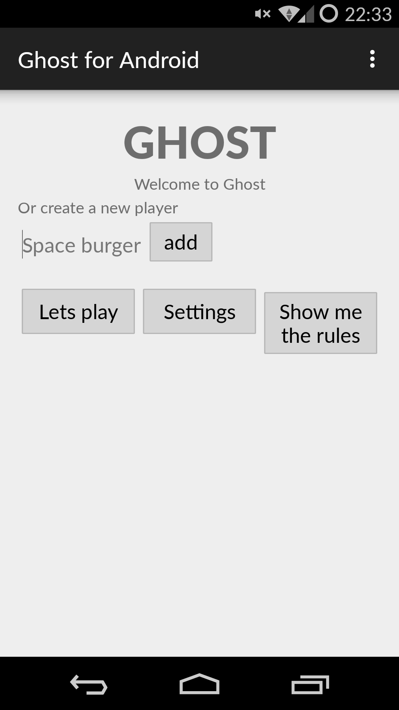
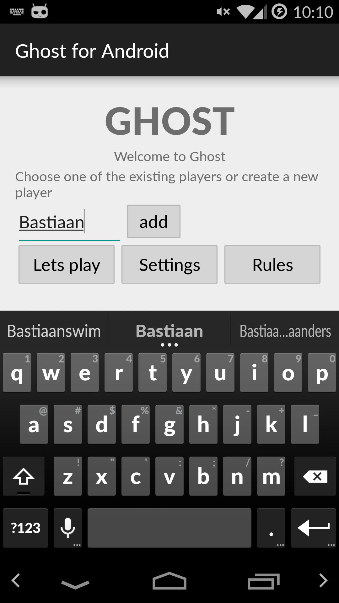
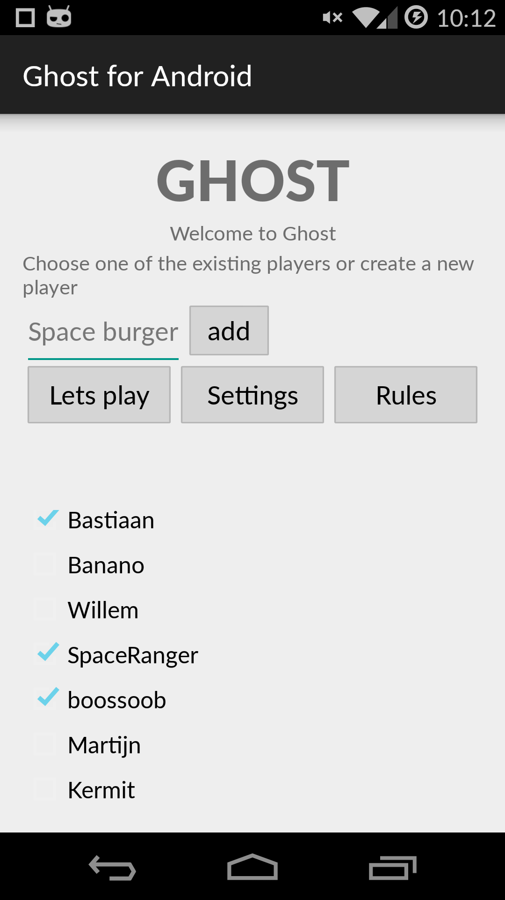
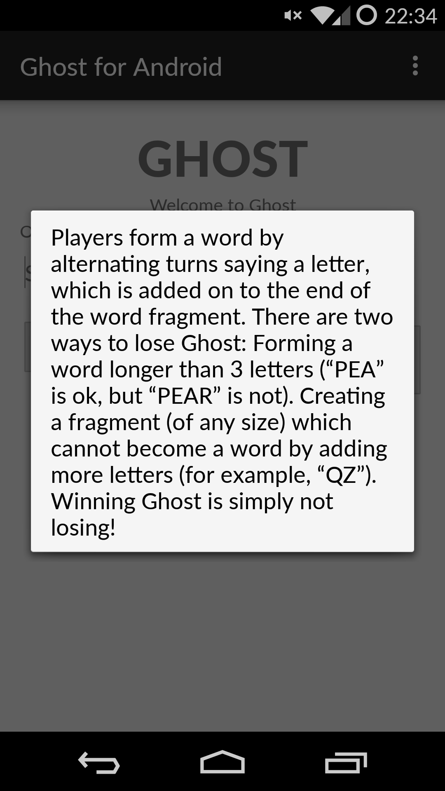
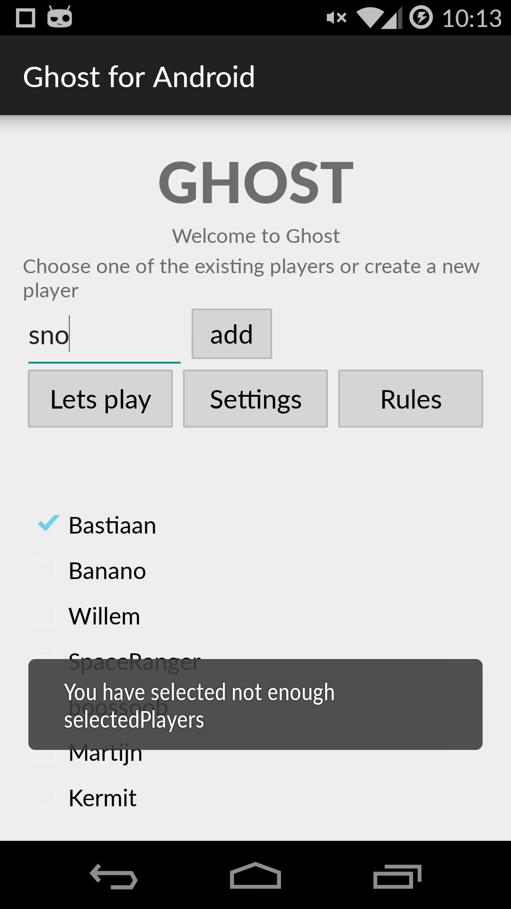

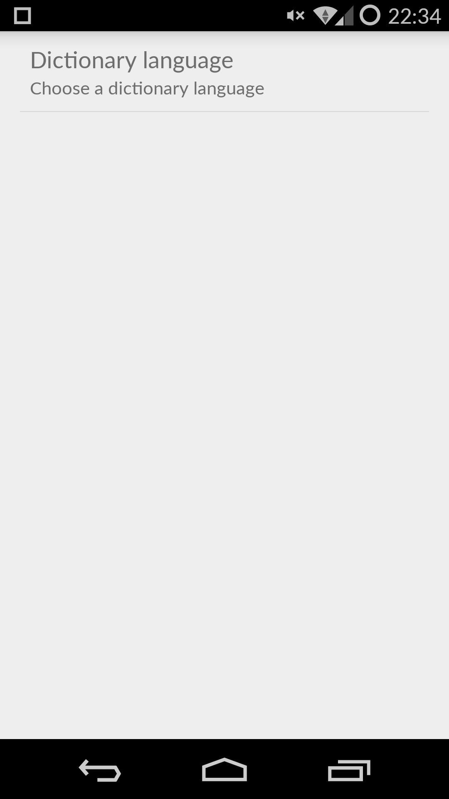
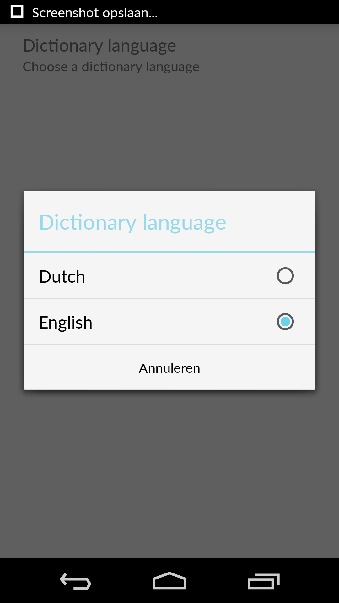

Game screen:
------------

The Game screen contains two TextViews which display the names of the selected players, respectively player one and player two, the name of the player who playing is displayed **BOLD** the other players name is display in normal style. Also there is a EditText element which gives the Active player the option to enter a character, only the characters "a b c d e f g h i j k l m n o p q r s t u v w x y z" are allowed. When a user enters a character it is automatically converted to a lowercase character. While for characters which are not allowed there is displayed a TOAST with the following message "Sorry, you entered a character which is not allowed, try again!". When a game ends there is shown a dialog which tells who has won the game and gives the option to go to the high scores.

The following images show the above-descripted possible actions about the gameplay.

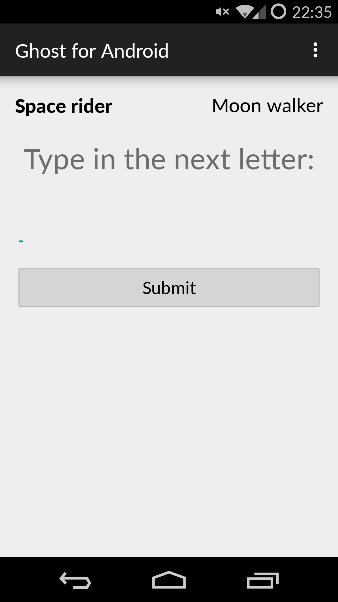
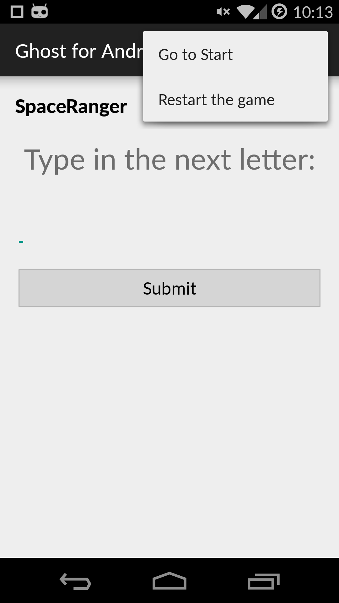
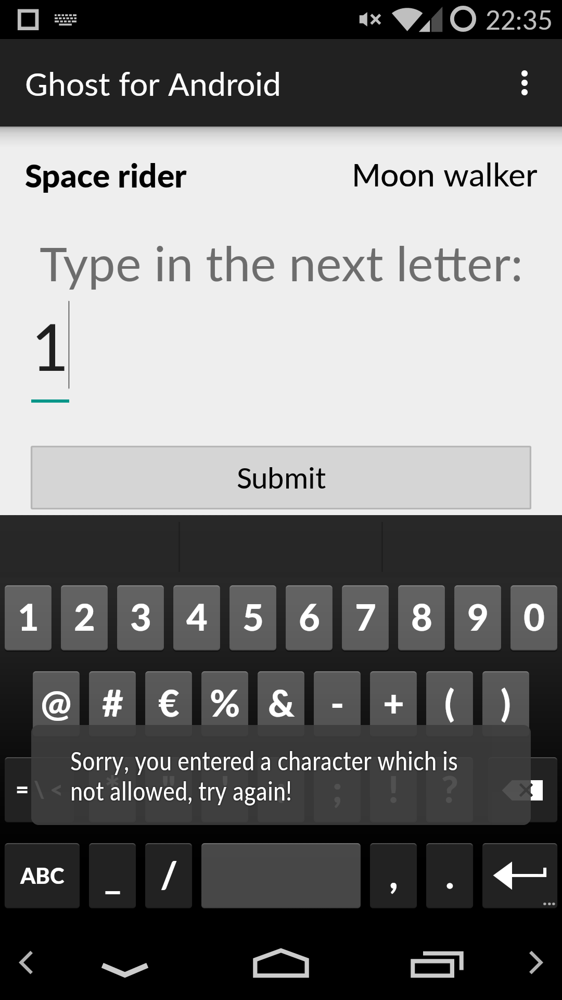
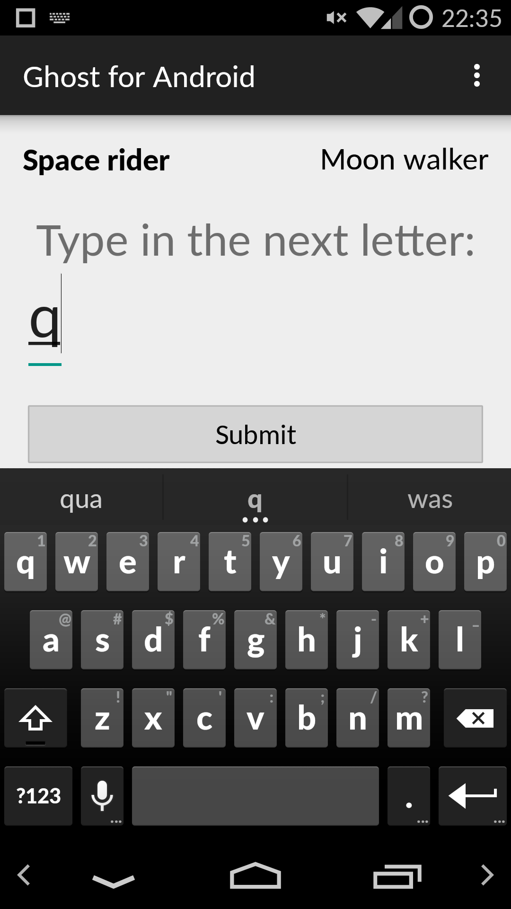
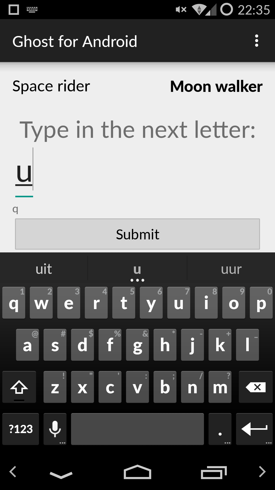
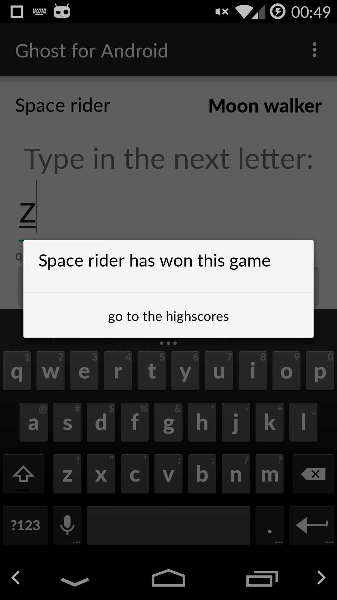

High score screen:
-----------------

The high score screen shows a list of all the users with there corresponding score, which is a simple TextView. At the bottom of the screen there are two buttons which gives the users the option to start a new game with the same users, or go back to the start screen to choose two other players, or create one or two new other players.

The following image shows the above-descripted possible actions about the highscore screen.
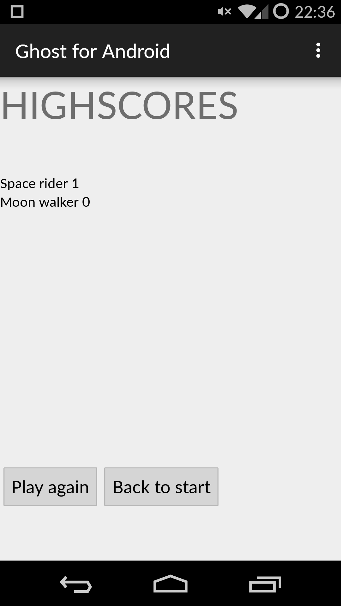
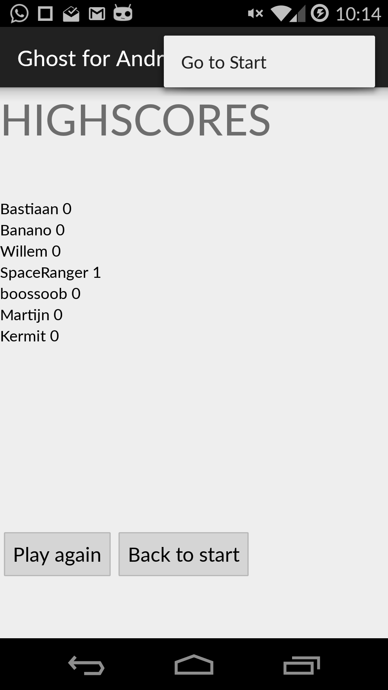

Model Classes, methods and function:
------------------------------------

The most important model in the application is the model class Player.java, every player that is created consists of a String contain the players name, a String containing their unique ID, and a int which contains the score of the player. Player(String name, String id, int score). The player model contains several functions:

* getName(), which returns the player name.
* getId(), which returns the player id.
* getScore(), which returns the player score.
* incrementScore(), which increments the score of the player by one.

And also several private fields

* private String name
* private String id
* private int score

The players who have been created in previous games are stored as player objects in the ArrayList allPlayers, the players who are selected to play the game are stored in the ArrayList selectedPlayers. By storing the players as player object in the ArrayLists the player can always be uniquely identifiable by their ID, which gives the possibility for players to create a player with the same name. While there might by two or more players with the same name, there wont be any mix up with their high score. 

In total there are nine different classes Dialog, Dictionary, Game, Game_activity, Highscore_activity, Player, Players, Settings and Start.

Start creates the first screen for the players and also handels the input from the player names.

****Dialog is called whenever there is need for a dialog screen, there are two dialogs possible****

* rules(), which returns a dialog screen with the text of the rules about ghost.
* gameEnd(), which returns a dialog screen with the of winner of the game and a button which triggers an intent to go to the high score list.

****Dictionary is called every time when a game starts, to load the dictionary with the set language, which is can be changed in the settings menu. ****

* Dictionary, returns a Hashset of all the words from the selected dictionary.
* MatchWord(), returns false when the word is in the dictionary or when there is no more substring found of any word which matches the input. Otherwise it returns true and the players turns switch.

****Game contains all the logic for the game and handles the input of the characters.*****

Array allowedLetters, contains all the characters which are allowed as input.
StringBuffer word, contains the characters entered so far. Chosen for a stringbuffer because a String is immutable.
String Letter, stores the entered character in lowercase.
int activePlayer, has a default value of 1 changes when the player changes.

* getWord(), returns the word.
* setWord(), clears the stringbuffer first after that append the letters which are passed on as on argument.
* getActivePlayer(), returns the activePlayer.
* setActivePlayer(), sets the int of activePlayer to its passed argument.
* changeActivePlayer(), switches the activePlayer from 1 to 2 or from 2 to 1.

The data flow of the entered character starts at the function getLetter which returns the entered character to lower case, then it checks if the character is indeed a character which is allowed to be entered, allowedLetter(). If not it throws a Toast with the message the player entered an invalid character. After that the character is appended to the stringbuffer by the function setLetter() which returns the word + the letter.

* checkMatchDictionary(), returns the value of matchWord from the Dictionary class.
* setPLayerstyle(), changes the text style from the active players.
* updateLayout(), add the input letter to the TextView and sets the value of edit text to empty
* incrementScoreWinner, increments the value of the player who won with game

****Game_activity is the controller of the game. It contains a onSaveInstanceState to save the word that is typed in so far when there is a possible onPauze action or when the orientation changes of the screen. Every time this activity is called it creates a new game.****

* setSelectedPlayers(), sets the entered player names as player1 and player2 on the screen.
* game(), handles the options of the gameplay, first it calls the game class function allowedLetter() to check if the entered character is allowed, if so it will check of the entered character forms a word or it might match a substring of a still possible word. If so the game class function updateLayout is called. If a word is formed or there is no possibility of forming any word the function gameOver is called.
* restartGame(), sets everything to zero and calls a Toast message to confirm the game has been restarted. This method can only be activated in the menu during the game.
* gameOver(), handels the ending of the game, increments the score of the player who won and activates the dialog gameEnd().
* invalidInput(), returns a Toast which tells the user it entered an invalid character.
* restartMessage(), returns a Toast which tells the players the game has been restarted.

****HighScore_activity, displays all the scores of the players****

* showHighScores(), returns all the players names with all their corresponding score.
* playAgain(), creates an intent for the game activity so the same players can play the game again.
* toStart(), creates an intent to go back to the start screen.

****Players, creates the player and adds them to the ArrayList, also saves and gets the ArrayList of the players from SharedPreferences****

ArrayList players, contains all the players which are created or have been created in previous games.
Gson playerGson, is used to store the custom ArrayList players as a json string in SharedPreferences.
Type arrayListType, returns the type of the ArrayList, which is used to changes the json string back to an ArrayList.

createPlayer(), creates a player by setting the argument name as name, calls setId() for the players id and sets the players score to 0.

allPlayers(), returns the ArrayList players.
setId(), checks if a previous created player has the same ID if so it will generate a new one, otherwise returns the generate Id as a string.
setPlayers(), gets the SharedPreferences for Players and decodes it from a json string to an ArrayList with the object player.
savePlayers(), stores the ArrayList players in to the SharedPreferences as a json string with the help of the gson libary.

****Settings, gives the player the option to change language.****

API's and frameworks
--------------------
The whole application makes use of several TextView's, EditText's, checkboxes, buttons, menu's, sharedpreferences and dialogs, which are all build in, in the android framework.

The Gson libary is used as an external library. Storing a non string object in the SharedPreference formed a problem. The gson libary is used to convert the player object to a json string that can be stored in the SharedPreference.

